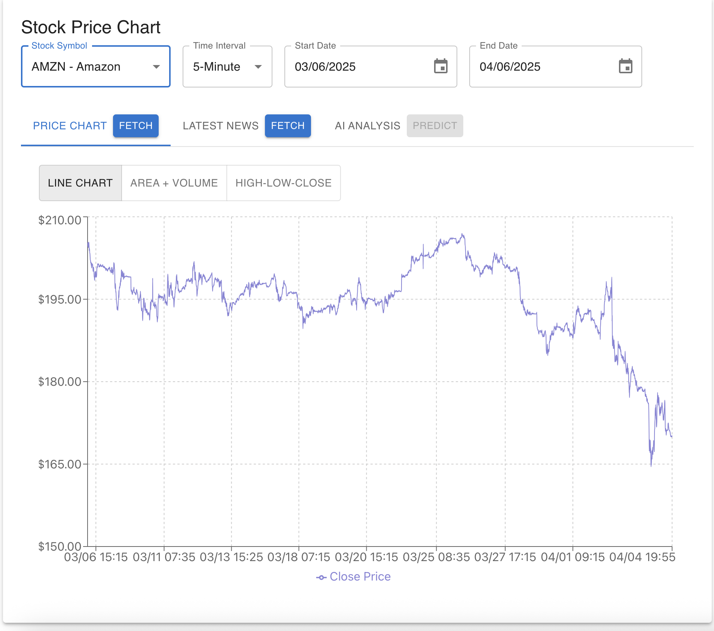
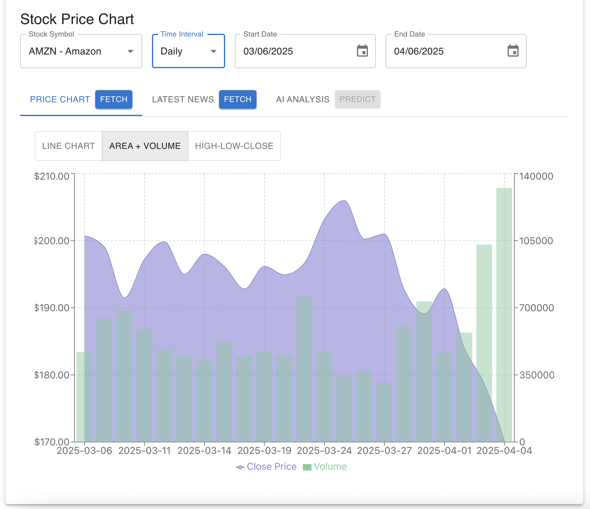
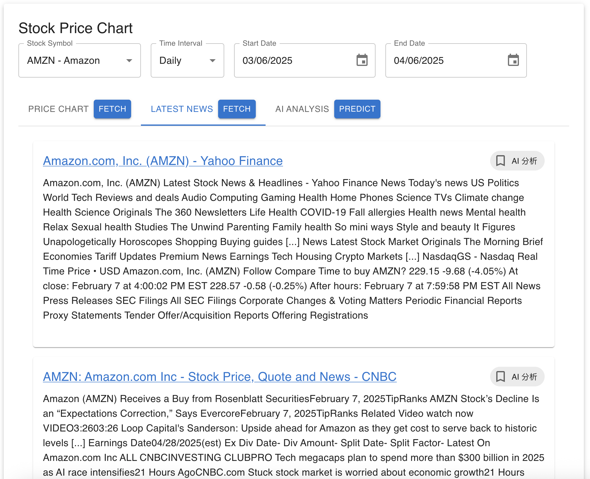
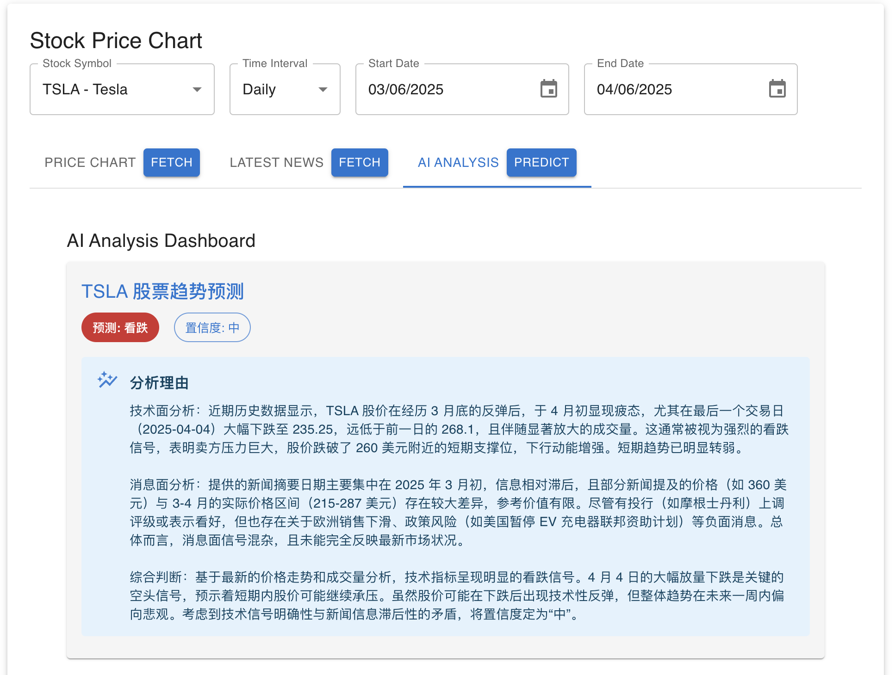
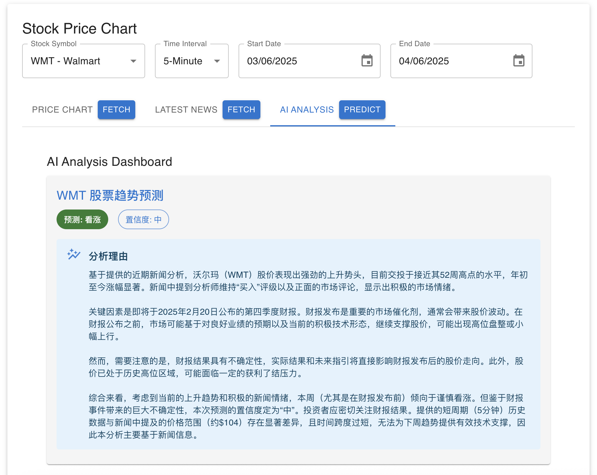

# Stock Market Data Visualization

A React-based web application for visualizing stock market data with real-time price charts, related news, and AI-powered analysis.

## Features

- Real-time stock price visualization
- Multiple chart types (Line, Area + Volume, High-Low-Close)
- Time interval selection (5min, Daily, Weekly, Monthly)
- Company news integration with AI analysis
- Stock trend prediction using AI
- API key management through environment variables
- Stock list configuration

## Tech Stack

- React
- TypeScript
- Material-UI
- Recharts
- Express (Backend)
- Alpha Vantage API (Stock Data)
- Tavily API (News Search)
- OpenRouter API (AI Analysis)

## Getting Started

1. Clone the repository:
```bash
git clone https://github.com/ssfeather/stock-market-visualization.git
cd stock-market-visualization
```

2. Install dependencies:
```bash
npm install
```

3. Configure environment variables:
   - Copy `.env.example` to `.env`
   ```bash
   cp .env.example .env
   ```
   - Edit `.env` and add your API keys:
   ```
   REACT_APP_OPENROUTER_API_KEY=your_openrouter_api_key_here
   REACT_APP_ALPHA_VANTAGE_API_KEY=your_alpha_vantage_api_key_here
   TAVILY_API_KEY=your_tavily_api_key_here
   ```

   You'll need to obtain API keys from:
   - [Alpha Vantage](https://www.alphavantage.co/) for stock data
   - [OpenRouter](https://openrouter.ai/) for AI analysis
   - [Tavily](https://tavily.com/) for news search

4. Start the development server:
```bash
# Start the backend server
node server.js

# In a new terminal, start the frontend
npm start
```

5. Open [http://localhost:3000](http://localhost:3000) to view the application.

## Configuration

### Environment Variables

The application uses the following environment variables:

- `REACT_APP_ALPHA_VANTAGE_API_KEY`: Your Alpha Vantage API key for stock data
- `REACT_APP_OPENROUTER_API_KEY`: Your OpenRouter API key for AI analysis
- `TAVILY_API_KEY`: Your Tavily API key for news search

### Stock Configuration

Stock symbols and intervals can be configured through the UI in the Configuration Management tab or by editing `src/config/api.ts`.

## Features

### Price Chart
- View stock prices in different time intervals
- Switch between multiple chart types
- Real-time data fetching




### News Feed
- Latest company news
- Direct links to news sources
- AI-powered news analysis
- Automatic news updates



### AI Analysis
- Stock trend prediction
- News sentiment analysis
- Technical analysis integration
- Chinese language support for predictions




## Development

### Branch Strategy

- `main`: Production-ready code
- `feature/*`: Feature development branches
- `bugfix/*`: Bug fix branches

### Contributing

1. Create a new feature branch
2. Make your changes
3. Submit a pull request

## License

MIT License

## Security

- API keys are managed through environment variables
- Sensitive data is not committed to the repository
- Example configuration is provided in `.env.example`
